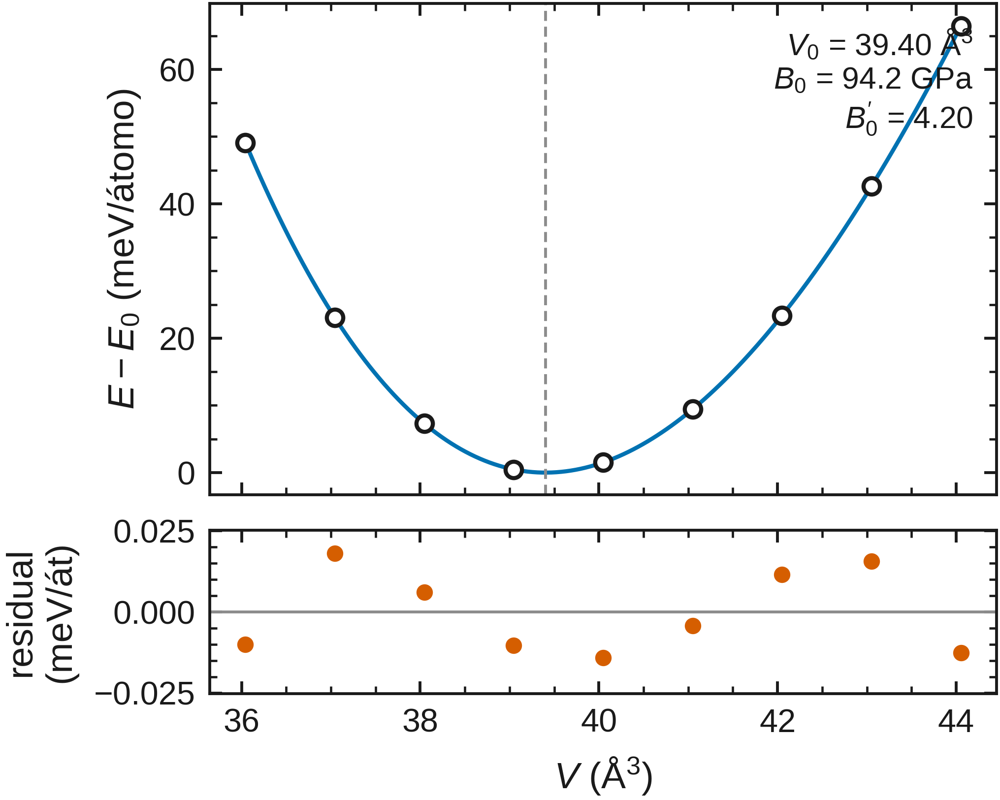
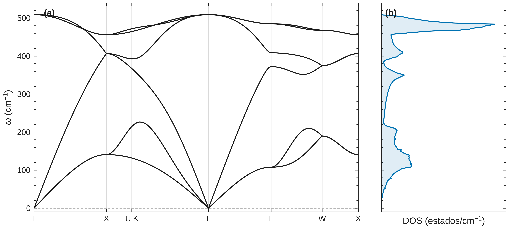

<h1 align="center">Olla-DFT</h1>

<p align="center"><b>From crystal structures to Quantum ESPRESSO results.</b><br>
Prepare calculations, analyze properties, and share figures and data.</p>

<p align="center">
<a href="https://github.com/jorgegonzalezsevilla/olla-dft/actions/workflows/ci.yml"></a>
<a href="LICENSE"></a>
<a href="https://doi.org/10.5281/zenodo.22263121"></a>
</p>

<p align="center"><a href="https://github.com/jorgegonzalezsevilla/olla-dft-esp">Versión en español</a> · <a href="docs/COMMANDS.md">Commands</a> · <a href="examples/">Examples</a> · <a href="https://jorgegonzalezsevilla.github.io/olla-dft-bench/publication-1.2.0/">Gallery and demo</a></p>

<p align="center"><a href="examples/demo_Si/"></a><br><sub>Silicon · bands and DOS. A QE example; the LDA gap is not the experimental gap.</sub></p>

## What you can do

| Area | Capabilities |
|---|---|
| Preparation | CIF/POSCAR/QE inputs, symmetry, pseudopotentials, k-meshes and band paths. |
| Electrons and spectra | Bands, DOS/PDOS, gaps, magnetism, optics, effective masses and Wannier workflows. |
| Vibrations and temperature | Phonons, harmonic thermodynamics, QHA and transport workflows. |
| Mechanics and materials | Convergence, equation of state, elasticity, surfaces, interfaces and defects. |
| Organization | Guided setup, projects, campaigns, quality checks and result provenance. |
| Visualization and continuity | Configurable figures, offline result exploration and recoverable `pw.x` jobs. |

The [full reference](docs/COMMANDS.md) also covers charges, advanced spectra, NEB, molecular dynamics and optional modules. Methods have different assumptions and validation coverage: see [theory](docs/THEORY.md) and [validation](docs/VALIDATION.md).

## A sample of the results

<table>
<tr>
<td width="50%"><a href="examples/demo_Fe/"></a><br><b>Magnetism · spin-resolved DOS</b></td>
<td width="50%"><a href="examples/demo_calculo/"></a><br><b>Mechanics · equation of state</b></td>
</tr>
<tr>
<td width="50%"><a href="examples/demo_propiedades/"></a><br><b>Vibrations · silicon phonons</b></td>
<td width="50%"><a href="examples/demo_propiedades/"></a><br><b>Optical response · silicon</b></td>
</tr>
</table>

Click an image for the example inputs, results and conditions. These are existing calculation examples, not universal validation or new simulations for this release.

[PDF gallery for reading or sharing](docs/gallery/olla-dft-gallery-en.pdf) · [Conditions and sources](docs/gallery/manifest.json)

## Get started

Requires **Python 3.9+**. Install Quantum ESPRESSO and pseudopotentials separately to run calculations; analysis of existing results does not require them. [Platforms and installation](docs/PLATFORMS.md).

```bash
git clone https://github.com/jorgegonzalezsevilla/olla-dft.git
cd olla-dft
python3 -m venv .venv
source .venv/bin/activate
pip install .
olla-dft info examples/demo_Si/Si.cif
olla-dft start --language en
```

`start` guides project creation. Use `olla-dft --help` or the [usage guide](docs/COMMANDS.md) to continue. The internal `qekit` package and `python -m qekit` remain compatible. Help and the explorer support English/Spanish; some scientific reports retain Spanish text.

## Explore, customize and export

```bash
olla-dft results ingest ./calculation --project ./my-project
olla-dft results explore --project ./my-project -o results.html
```

Open `results.html`: filter calculations, choose metrics and units, select records, and adjust the title, color, size and axes. Download **SVG, PNG, CSV, JSON or interactive HTML**, offline. The HTML contains a fixed copy of the records: it does not query the database or update itself. Regenerate it to include new results.

[Try the 1.2.0 demo](https://jorgegonzalezsevilla.github.io/olla-dft-bench/publication-1.2.0/explorer.html) · [Export guide and limits](docs/RESULTS-EXPLORER.md)

## Continue after an interruption

`olla-dft resilient` saves and verifies checkpoints to resume supported `pw.x` jobs when the disk survives. Set up the persistent environment first: [recovery guide](docs/resilience/RECUPERACION.md) (Spanish).

Local SCF, `relax` and `vc-relax` pairs were checked with simulated process interruptions. Google Cloud VM replacement, disk loss recovery and financial savings **have not been demonstrated**. [Results and tolerances](https://jorgegonzalezsevilla.github.io/olla-dft-bench/publication-1.2.0/index-en.html) · [Recovery contract](docs/resilience/CONTRACT.md).

## Documentation, quality and citation

[Commands](docs/COMMANDS.md) · [Theory](docs/THEORY.md) · [Validation](docs/VALIDATION.md) · [Architecture](docs/ARCHITECTURE.md) · [Reproducible benchmark](https://github.com/jorgegonzalezsevilla/olla-dft-bench) · [Changes](CHANGELOG.md)

A personal project by **Jorge Enrique González Sevilla**, developed in Guadalajara, Mexico; independent of Quantum ESPRESSO. Free software under **GPL-3.0-or-later**, with no automatic telemetry. [Bug reports and ideas](https://github.com/jorgegonzalezsevilla/olla-dft/issues) are welcome; code is maintained by the author ([contributing](CONTRIBUTING.md)).

Cite the version you used through [CITATION.cff](CITATION.cff) and [Zenodo](https://doi.org/10.5281/zenodo.22263121). Also cite Quantum ESPRESSO and your pseudopotentials. [License](LICENSE) · [Third-party notices](THIRD_PARTY_NOTICES.md).
